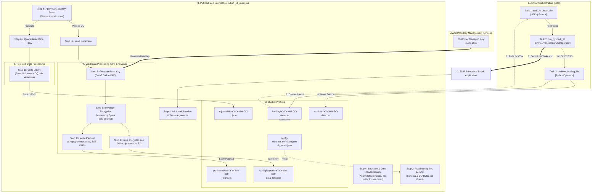

# End-to-End Pipeline Data Flow

This document provides a highly detailed walkthrough of our production data pipeline. It maps the **Airflow Orchestration** tasks directly to the internal **PySpark Job execution steps** (`etl_main.py`) to show how data is ingested, validated, quarantined, encrypted, and archived.

---

## 🗺️ Complete End-to-End Architecture Flow

---

## ⏱️ Step-by-Step Data Lifecycle Walkthrough

### Phase A: Ingestion & Orchestration (Airflow)
1. **S3 File Check:** The Airflow `S3KeySensor` polls the landing bucket prefix (`landing/2026-05-18/data.csv`) every 5 minutes.
2. **Compute Wake-up:** Once the CSV lands, the `EmrServerlessStartJobOperator` triggers EMR Serverless. Because we configured EMR with **Auto-Start**, the application spins up EMR worker nodes dynamically (4 driver vCPUs, 4 executor vCPUs).

---

### Phase B: Core ETL & Validation (PySpark)
3. **Configurations Load:** Spark starts the driver script (`etl_main.py`). The script uses `boto3` to fetch two configuration payloads directly from S3 into memory:
   - `schema_definition.json` (Columns, types, null handling strategy)
   - `dq_rules.json` (Valid range checks, string patterns, email regexes)
4. **CSV Read & Partitioning:** Spark reads the CSV file. Since it is a **UTF-8** file, Spark splits the 100MB file into **4 parallel partitions**, distributing the workload across all 4 executor cores.
5. **Structural Standardisation:** The `SchemaValidator` class handles structural fixes:
   - Evaluates columns.
   - If a non-essential field like `name` is missing, it applies the `"fill"` strategy (`"Unknown"`).
   - If a field is blank, it flags it (e.g., creating `is_email_null = True`).
6. **Date Formatting:** We cast transaction dates to standard ISO format (`YYYY-MM-DD`) using Spark's native date evaluation functions.

---

### Phase C: Plaintext Data Quality Filtering
7. **DQ Engine Execution:** The `DataQualityEngine` runs **before** encryption occurs. It applies our business validation rules to the plaintext data:
   - `RQ_001`: Checks if `customer_id` is present.
   - `RQ_002`: Checks if `amount` is between `0` and `1,000,000`.
   - `RQ_003`: Checks if `transaction_date` is parsed successfully.
   - `RQ_004`: Validates the `email` structure using regex (`^[^@]+@[^@]+\.[^@]+$`).
8. **Pipeline Branching:** Spark splits the main DataFrame into two distinct paths:
   - **`valid_df`**: Contains records that passed 100% of the DQ rules.
   - **`rejected_df`**: Contains records that failed one or more DQ rules, appended with a `dq_failed_rules` array containing the specific rule IDs (e.g., `["RQ_001", "RQ_004"]`).

---

### Phase D: Double-Layer Security & Envelope Encryption
9. **KMS Handshake:** The Spark Driver makes a single HTTPS call to AWS KMS using `boto3.client('kms').generate_data_key()`.
10. **Data Key Generation:** KMS returns:
    - **Plaintext Data Key** (in-memory only, never written to disk or logs).
    - **Ciphertext Data Key** (encrypted by AWS’s Master Key).
11. **In-Memory Encryption:** Spark uses its native, hardware-accelerated `aes_encrypt` function to scramble the SPII columns (`email` and `phone`) in the `valid_df` using the Plaintext Data Key. This happens completely in worker RAM.
12. **KMS Metadata Save:** The ciphertext data key is written to S3 as `data_key.json` inside the `config/keys/dt=YYYY-MM-DD/` prefix.

---

### Phase E: Output Writing & Archiving
13. **Write Valid Data:** The encrypted `valid_df` is written to `processed/dt=2026-05-18/` as Snappy-compressed Parquet. EMRFS enforces **SSE-KMS storage encryption** on the write operation.
14. **Write Quarantined Data:** The unencrypted `rejected_df` is written to `rejected/dt=2026-05-18/` as a readable JSON dataset. This allows data stewards to query the bad data and inspect which rules failed.
15. **Source Archival:** EMR Serverless reports `SUCCESS` to Airflow. The Airflow `PythonOperator` triggers the final step: copying `landing/2026-05-18/data.csv` to `archive/2026-05-18/data.csv` (using KMS storage encryption) and deleting the raw landing file to keep the landing zone clear.
16. **S3 Lifecycle Eviction:** S3’s native lifecycle policies track the `archive/` prefix and automatically purge files older than 2 days to minimize storage costs.
