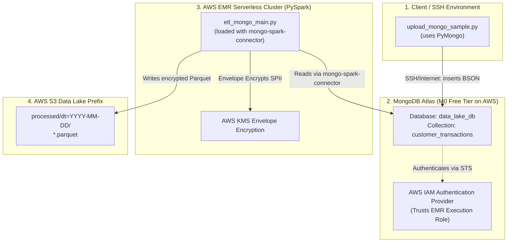

# Phase 8 — MongoDB Atlas Serverless Integration & Connectivity

This guide details the end-to-end integration of a serverless MongoDB Atlas database as our pipeline's primary raw landing source. We use **AWS IAM Database Authentication** for secure, passwordless access from EMR Serverless, keeping all resources within free tiers.

---

## 🏗️ Architectural Flow



---

## 📋 Pre-requisites & Cost Verification
* **MongoDB Atlas M0 Cluster:** **$0.00** (Forever Free Tier).
* **AWS EMR Serverless Execution Role:** Configured in Phase 1 (`EMR_Serverless_ExecutionRole`).
* **VPC/Networking:** None. We use the public internet routing for EMR Serverless worker nodes, completely avoiding NAT Gateway charges ($0.00/month).

---

## 🛠️ Step 1: Set Up MongoDB Atlas M0 Cluster

1. Go to [MongoDB Atlas](https://www.mongodb.com/cloud/atlas) and register for a free account.
2. Click **Create a Cluster** and configure it with:
   - **Cluster Type:** Shared (M0 Free).
   - **Cloud Provider:** **AWS**.
   - **Region:** **London (`eu-west-2`)** — *Crucial: must match your EMR Serverless region!*
   - **Cluster Name:** `Cluster0` (or your choice).
3. Click **Create**.

---

## 🔒 Step 2: Configure Passwordless AWS IAM Database Access

MongoDB Atlas will authenticate EMR using AWS STS. Let's register your EMR Execution Role as a database user.

1. In MongoDB Atlas, go to **Security** ➡️ **Database Access** ➡️ **Add New Database User**.
2. Select **AWS IAM** under *Authentication Method*.
3. Select **IAM Role** under *IAM Type*.
4. Paste your exact EMR Execution Role ARN:
   ```text
   arn:aws:iam::038849867257:role/EMR_Serverless_ExecutionRole
   ```
5. Set database permissions:
   - **Roles:** `Read and write to any database` (or custom access to `data_lake_db`).
6. Click **Add User**.

---

## 🌐 Step 3: Network Security (IP Access List)

EMR Serverless default nodes run on dynamic public IP addresses. 

1. Go to **Security** ➡️ **Network Access** ➡️ **Add IP Address**.
2. Click **Allow Access From Anywhere** (adds `0.0.0.0/0`).
3. Click **Confirm**.

---

## 🐍 Step 4: Populate MongoDB Atlas with Mock Data (SSH Uploader)

We have created an upload script under `data/sample/upload_mongo_sample.py`. This script connects to Atlas and inserts mock transaction records.

### How to get MongoDB's Connection String:
1. In MongoDB Atlas, go to **Deployment** ➡️ **Database** ➡️ Click **Connect** next to `Cluster0`.
2. Select **Drivers**.
3. Copy the standard connection string (it looks like `mongodb+srv://<username>:<password>@cluster0.xxxx.mongodb.net/?retryWrites=true&w=majority`).

### SSH execution on Airflow EC2 instance:
If you are logged into your Airflow EC2 instance via SSH:
```bash
# 1. Install dependencies
pip3 install pymongo dnspython

# 2. Set your connection string as an environment variable
export MONGO_URI="mongodb+srv://<username>:<password>@cluster0.xxxx.mongodb.net/?retryWrites=true&w=majority"

# 3. Run the uploader tool to seed 1,000 collections
python3 data/sample/upload_mongo_sample.py
```

---

## 🧪 Step 5: Validate EMR Serverless Connectivity

We deploy `spark_jobs/mongo_connection_test.py` first. This lightweight script runs a basic check:
1. Connects to MongoDB Atlas using EMR's IAM Execution Role credentials.
2. Fetches 1 document.
3. Prints the output to CloudWatch / S3 Logs.

### How to trigger via Airflow or CLI:

> [!NOTE]
> Since default EMR Serverless applications are network-isolated and cannot access the public internet to download packages from Maven Central, utilizing `--packages` at runtime will cause a `ConnectException: Connection timed out`. Instead, we upload the connector and driver dependency JARs directly to S3 and pass them via the `--jars` parameter.

Submit a Spark job run using these parameters:
```bash
aws emr-serverless start-job-run \
  --application-id <EMR-APP-ID> \
  --execution-role-arn <EXECUTION-ROLE-ARN> \
  --job-driver '{
    "sparkSubmit": {
      "entryPoint": "s3://<BUCKET-NAME>/scripts/mongo_connection_test.py",
      "sparkSubmitParameters": "--jars s3://<BUCKET-NAME>/jars/mongo-spark-connector_2.12-10.3.0.jar,s3://<BUCKET-NAME>/jars/mongodb-driver-sync-4.8.2.jar,s3://<BUCKET-NAME>/jars/mongodb-driver-core-4.8.2.jar,s3://<BUCKET-NAME>/jars/bson-4.8.2.jar,s3://<BUCKET-NAME>/jars/mongodb-crypt-1.5.2.jar"
    }
  }'
```

---

## ⚡ Step 6: Full ETL Pipeline (`etl_mongo_main.py`)

Once connectivity is verified, the core ETL job processes data by:
1. Reading all documents from `data_lake_db.customer_transactions` using EMR's IAM Role.
2. Converting the BSON MongoDB types into standard PySpark StructTypes.
3. Filtering invalid records via `DataQualityEngine` (before encryption).
4. Running KMS Envelope Encryption on `email` and `phone` columns.
5. Saving Snappy-compressed Parquet files to `s3://.../processed/`.
