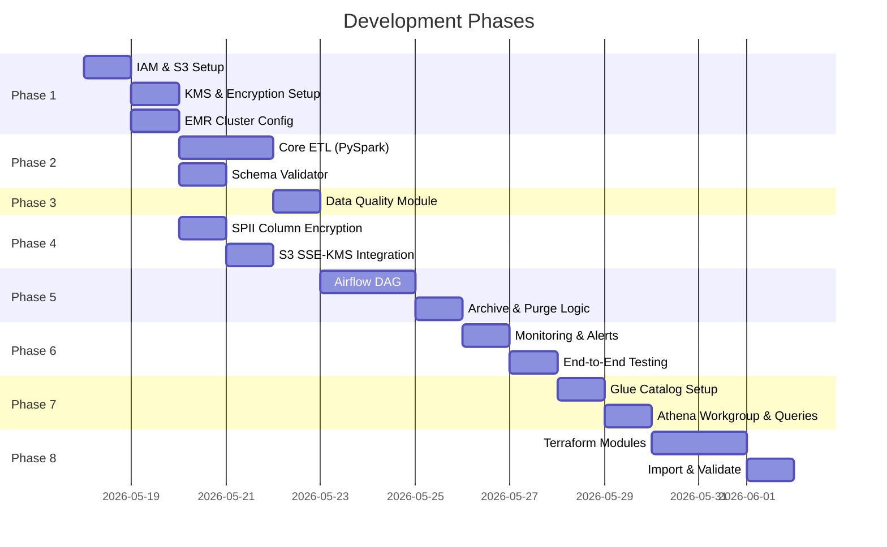

# MVP Design — AWS EMR + PySpark + Airflow Data Pipeline

## 🎯 Goal

Build a **production-grade daily data pipeline** on AWS that reads CSV from S3, validates schema, applies transformations (null handling, date standardisation, SPII encryption), writes encrypted Parquet to S3, with full idempotency, archival, purging, logging — orchestrated by Airflow on a 7-day schedule.

## 📦 Repository

| Item | Value |
|------|-------|
| **GitHub** | `https://github.com/maniprakashthandapani-hub/aws.git` |
| **Local Path** | `c:\Users\91999\Downloads\Claude\aws_data_engineer` |
| **Branch** | `main` |
| **Status** | ✅ Git initialized, remote linked, empty repo ready for first commit |

---

## Architecture Overview

```
┌─────────────┐      ┌──────────────┐      ┌─────────────────┐
│  S3 Landing  │─────▶│  EMR Cluster  │─────▶│  S3 Processed   │
│  (CSV Input) │      │  (PySpark)    │      │  (Parquet/SSE)  │
└─────────────┘      └──────┬───────┘      └────────┬────────┘
                            │                       │
                     ┌──────▼───────┐      ┌────────▼────────┐
                     │  S3 Logs     │      │  S3 Archive     │
                     │  (EMR/Spark) │      │  (2-day retain) │
                     └──────────────┘      └─────────────────┘
                            ▲                       │
                     ┌──────┴───────┐      ┌────────▼────────┐
                     │   Airflow    │      │  Glue Catalog   │
                     │   (MWAA/EC2) │      │  + Athena Query │
                     └──────────────┘      └─────────────────┘
                       Daily DAG (7 days)    Data Lake Layer
```

---

## ⚡ Spark Tuning — 1 GB CSV Workload on m5.xlarge

### Instance Specs: `m5.xlarge`

| Resource | Value |
|----------|-------|
| vCPUs | 4 |
| RAM | 16 GiB |
| Network | Up to 10 Gbps |
| EBS Bandwidth | Up to 4,750 Mbps |

### Memory Math (Per Node)

```
Total RAM per node:              16 GiB
├── OS + YARN NodeManager:       -2 GiB  (reserved)
├── YARN Available:              14 GiB
│
├── DRIVER (runs on Master node):
│   ├── spark.driver.memory:      2g
│   └── spark.driver.memoryOverhead: 512m (max(384m, 10% of 2g))
│   └── Total Driver Container:   2.5g
│
└── EXECUTOR (runs on Core node):
    ├── spark.executor.memory:     4g
    ├── spark.executor.memoryOverhead: 1g (max(384m, 10% + buffer))
    ├── Total per Executor:        5g
    ├── Number of Executors:       2 (on 1 core node)
    └── Cores per Executor:        2 (total 4 cores utilised)
```

### Recommended `spark-submit` Configuration

```bash
spark-submit \
  --deploy-mode cluster \
  --master yarn \
  --driver-memory 2g \
  --driver-cores 2 \
  --executor-memory 4g \
  --executor-cores 2 \
  --num-executors 2 \
  --conf spark.sql.adaptive.enabled=true \
  --conf spark.sql.adaptive.coalescePartitions.enabled=true \
  --conf spark.sql.shuffle.partitions=8 \
  --conf spark.serializer=org.apache.spark.serializer.KryoSerializer \
  --conf spark.sql.parquet.compression.codec=snappy \
  --conf spark.hadoop.fs.s3a.server-side-encryption-algorithm=SSE-KMS \
  --conf spark.hadoop.fs.s3a.server-side-encryption.key=<KMS_KEY_ARN> \
  --conf spark.dynamicAllocation.enabled=false \
  s3://my-data-pipeline/scripts/etl_main.py
```

### Why These Values?

| Config | Value | Rationale |
|--------|-------|----------|
| `driver-memory` | `2g` | 1GB CSV expands ~3-4x in memory; driver handles plan only, no `collect()` |
| `executor-memory` | `4g` | Comfortable headroom for 1GB CSV → transformations → Parquet write |
| `executor-cores` | `2` | Matches parallelism to data size; avoids thread contention |
| `num-executors` | `2` | 2 executors × 2 cores = 4 parallel tasks |
| `shuffle.partitions` | `8` | Default 200 is overkill for 1GB; 8 partitions ≈ 125MB each (ideal) |
| `AQE enabled` | `true` | Auto-coalesces small partitions, handles skew joins |
| `dynamicAllocation` | `false` | Fixed cluster, no YARN overhead for scaling |
| `KryoSerializer` | `true` | 10x faster than Java serializer for shuffles |

### Critical Anti-Patterns to Avoid

| ❌ Don't | ✅ Do Instead |
|----------|---------------|
| `df.collect()` on full dataset | Use `df.write` or `df.take(10)` for debugging |
| Python UDFs for row-level ops | Use native PySpark SQL functions |
| `SELECT *` on wide tables | Select only needed columns early |
| `repartition(200)` on 1GB | `coalesce(4)` before writing Parquet |
| Cache DataFrames unnecessarily | Cache only if reused 2+ times |
| Leave `shuffle.partitions=200` | Set to `8` for 1GB data |

### File Output Sizing

```
1 GB CSV → ~250-350 MB Parquet (Snappy compression)
         → coalesce(4) = 4 files × ~75 MB each (ideal for Athena)
```

> [!TIP]
> Target Parquet file size of **64–128 MB** per file for optimal Athena query performance. With `coalesce(4)` on a 1GB CSV, you'll get ~75MB per file — perfect.

---

## S3 Bucket Layout

```
s3://my-data-pipeline-<account-id>/
├── landing/                    # Raw CSV files dropped here
│   └── YYYY/MM/DD/
├── processed/                  # Final Parquet output (SSE-KMS encrypted)
│   └── YYYY/MM/DD/
├── archive/                    # Processed input CSVs moved here
│   └── YYYY/MM/DD/            # Auto-purged after 2 days
├── rejected/                   # Failed quality check records
│   └── YYYY/MM/DD/
├── logs/
│   ├── emr/                   # EMR cluster logs
│   └── airflow/               # Airflow remote logs
├── scripts/                    # PySpark scripts & configs
│   ├── etl_main.py
│   ├── schema_validator.py
│   ├── data_quality.py
│   └── encryption_utils.py
└── config/
    └── schema_definition.json  # Expected schema contract
```

---

## 🏗️ Development Phases (Bird's Eye View)

### Phase 1 — AWS Infrastructure & IAM (Foundation)

| Item | Detail |
|------|--------|
| **EMR Cluster** | Transient cluster, `m5.xlarge` (1 master + 1 core), EMR 7.x, Spark 3.5+ |
| **S3 Buckets** | Single bucket with prefix-based separation (see layout above) |
| **IAM Roles** | `EMR_DefaultRole`, `EMR_EC2_DefaultRole`, custom policy for S3 + KMS |
| **KMS Key** | One CMK for S3 SSE-KMS encryption + column-level AES key |
| **VPC/Subnet** | Default VPC is fine for MVP; security group with minimal ingress |
| **Logging** | EMR logs → `s3://…/logs/emr/`, Spark event logs enabled |
| **Budget Alert** | AWS Budget alarm at $10 threshold |

**Key Deliverables:**
- [ ] CloudFormation / CLI script for EMR cluster creation
- [ ] IAM policy JSON (least-privilege for S3, KMS, EMR, CloudWatch)
- [ ] KMS key creation with alias
- [ ] S3 bucket with lifecycle rules (archive purge = 2 days)
- [ ] Security group configuration

---

### Phase 2 — PySpark Core ETL (`etl_main.py`)

| Step | What Happens |
|------|-------------|
| **Read** | Read CSV from `s3://…/landing/YYYY/MM/DD/` with explicit schema |
| **Schema Validate** | Compare DataFrame schema against `schema_definition.json` |
| **Null Handling** | Apply rules per column: drop / fill / flag |
| **Date Standardisation** | Parse mixed formats → `yyyy-MM-dd` using `to_date()` |
| **SPII Encryption** | AES-256 encrypt PII columns (SSN, email, phone) using KMS data key |
| **Transformations** | Business logic (derived columns, filters, dedup) |
| **Data Quality** | Pre-write checks: row count, null %, duplicate %, value ranges |
| **Write** | Write Parquet to `s3://…/processed/YYYY/MM/DD/` with SSE-KMS |
| **Archive** | Move source CSV → `s3://…/archive/YYYY/MM/DD/` |

**Key Deliverables:**
- [ ] `etl_main.py` — Main PySpark entry point
- [ ] `schema_validator.py` — Schema contract enforcement module
- [ ] `encryption_utils.py` — KMS-backed AES column encryption
- [ ] `config/schema_definition.json` — Expected schema contract
- [ ] Sample CSV test data

---

### Phase 3 — Data Quality Framework (`data_quality.py`)

```
PRE-PROCESSING CHECKS          POST-PROCESSING CHECKS
─────────────────────          ──────────────────────
✓ Schema match                 ✓ Output row count > 0
✓ Required columns present     ✓ No null in mandatory cols
✓ No empty file (row count>0)  ✓ Parquet file size sanity
✓ Date column parseable        ✓ Partition path correctness
✓ No full-duplicate rows       ✓ Checksum / record count log
```

| Check | Action on Failure |
|-------|-------------------|
| Schema mismatch | **ABORT** — write to rejected/, raise error |
| Null % > threshold | **WARN** — log, continue (configurable) |
| Duplicate rows | **DEDUPLICATE** — log count removed |
| Date parse failure | **QUARANTINE** — move bad rows to rejected/ |
| Empty input file | **SKIP** — log, mark DAG success (no-op) |
| Output row count = 0 | **ABORT** — do not write empty parquet |

**Key Deliverables:**
- [ ] `data_quality.py` — Reusable DQ check module
- [ ] DQ report written to S3 logs per run
- [ ] Configurable thresholds via JSON config

---

### Phase 4 — Security & Encryption

| Layer | Implementation |
|-------|---------------|
| **Column-Level (SPII)** | `pyspark.sql.functions.aes_encrypt()` with KMS data key |
| **File-Level (S3)** | SSE-KMS on `processed/` and `archive/` prefixes |
| **In-Transit** | HTTPS (S3 endpoints), EMRFS with TLS |
| **Key Management** | AWS KMS CMK, key rotation enabled |
| **Bucket Policy** | Deny `PutObject` without `SSE-KMS` header |
| **IAM** | Least-privilege: only EMR role can read landing, write processed |

**Key Deliverables:**
- [ ] KMS key policy with rotation
- [ ] S3 bucket policy enforcing encryption
- [ ] Column encryption/decryption utility tested
- [ ] IAM policy with resource-level ARN restrictions

---

### Phase 5 — Airflow Orchestration (DAG)

```python
# DAG: daily_emr_etl_pipeline
# Schedule: Daily for 7 days from start_date
# Idempotent: Yes (overwrite partition, dedup)

start ──▶ check_source_file_exists
              │
              ▼
         create_emr_cluster (transient)
              │
              ▼
         submit_spark_step (etl_main.py)
              │
              ▼
         monitor_step_completion (sensor)
              │
              ▼
         validate_output_exists
              │
              ▼
         archive_source_file
              │
              ▼
         purge_old_archives (>2 days)
              │
              ▼
         terminate_emr_cluster
              │
              ▼
           end
```

| DAG Config | Value |
|-----------|-------|
| `schedule_interval` | `@daily` |
| `start_date` | Job start date |
| `end_date` | `start_date + 7 days` |
| `catchup` | `False` |
| `max_active_runs` | `1` |
| `retries` | `2` with 5-min delay |
| `on_failure_callback` | SNS email alert |

**Idempotency Strategy:**
- Partition path = `YYYY/MM/DD` based on `execution_date`
- Overwrite mode on target partition (no duplicates on re-run)
- Archive uses `execution_date` prefix (same file won't re-archive)

**Key Deliverables:**
- [ ] `dags/daily_emr_etl.py` — Production DAG
- [ ] `dags/utils/emr_config.py` — Cluster config helper
- [ ] `dags/utils/s3_helpers.py` — S3 check/archive/purge utilities
- [ ] Airflow connections configured (aws_default)
- [ ] Logging to S3 enabled

---

### Phase 6 — Operations, Monitoring & Maintenance

| Persona | Concern | Solution |
|---------|---------|----------|
| **DevOps** | Cluster cost runaway | Auto-terminate after 1hr idle; budget alerts |
| **DevOps** | Log accessibility | EMR logs + Spark UI logs → S3; Airflow remote logging |
| **App Maintenance** | Failed runs | Airflow retry (2x); SNS alert on final failure |
| **App Maintenance** | Data reprocessing | Idempotent design; Airflow backfill by date |
| **Product Owner** | Data freshness SLA | DAG SLA miss alert (if not done by 8 AM) |
| **Product Owner** | Pipeline health | Daily DQ report in S3; dashboard-ready metrics |
| **Data Consumer** | Schema trust | Schema contract in JSON; validation before write |
| **Data Consumer** | PII safety | SPII columns encrypted; only authorised roles decrypt |
| **Data Consumer** | Historical data | Archive retains 2 days; processed/ is permanent |

**Key Deliverables:**
- [ ] CloudWatch alarms (EMR idle, S3 errors)
- [ ] SNS topic for pipeline failure alerts
- [ ] S3 lifecycle rule for archive purge (2-day expiry)
- [ ] Runbook document for common failure scenarios

---

### Phase 7 — Data Lake & Athena Query Layer

Build a queryable data lake on top of the `processed/` Parquet data using AWS Glue Catalog and Amazon Athena.

```
┌─────────────────────────────────────────────────────┐
│                   DATA LAKE LAYER                    │
│                                                     │
│  S3 processed/           Glue Data Catalog           │
│  └── YYYY/MM/DD/*.parq   └── database: data_lake_db │
│                              └── table: processed    │
│                                  ├── partition: dt   │
│                                  └── schema: auto    │
│                                                     │
│  Athena ──▶ SQL queries against Glue table           │
│             (scans only needed partitions/columns)   │
└─────────────────────────────────────────────────────┘
```

| Component | Configuration |
|-----------|---------------|
| **Glue Database** | `data_lake_db` — logical namespace |
| **Glue Table** | `processed_data` — points to `s3://…/processed/` |
| **Partitioning** | `dt=YYYY-MM-DD` (Hive-style partition key) |
| **Glue Crawler** | On-demand or triggered by Airflow post-write |
| **Athena Workgroup** | `data-pipeline-wg` with query result location and cost limit |
| **Athena Output** | `s3://…/athena-results/` (auto-created) |

#### Airflow Integration

Add a Glue partition repair step in the DAG after successful Parquet write:

```python
# In DAG — after validate_output_exists
repair_partitions = AthenaOperator(
    task_id='repair_table_partitions',
    query='MSCK REPAIR TABLE data_lake_db.processed_data',
    database='data_lake_db',
    output_location='s3://my-data-pipeline/athena-results/',
)
```

#### Parquet Write Format (Hive-compatible partitioning)

```python
# In etl_main.py — write with partition key for Athena discovery
df_final.write \
    .mode("overwrite") \
    .partitionBy("dt") \
    .option("path", "s3://my-data-pipeline/processed/") \
    .format("parquet") \
    .save()
```

#### Sample Athena Queries (for Data Consumers)

```sql
-- Query today's processed data
SELECT * FROM data_lake_db.processed_data
WHERE dt = '2026-05-18' LIMIT 100;

-- Aggregation across all 7 days
SELECT dt, COUNT(*) as row_count,
       COUNT(DISTINCT customer_id) as unique_customers
FROM data_lake_db.processed_data
GROUP BY dt ORDER BY dt;

-- Data quality audit
SELECT dt, 
       SUM(CASE WHEN email_encrypted IS NULL THEN 1 ELSE 0 END) as null_emails
FROM data_lake_db.processed_data
GROUP BY dt;
```

**Key Deliverables:**
- [ ] Glue database and table creation (CLI/CloudFormation)
- [ ] Glue Crawler configuration (or `MSCK REPAIR TABLE`)
- [ ] Athena workgroup with cost controls
- [ ] PySpark write reformatted for Hive-style partitioning (`dt=YYYY-MM-DD`)
- [ ] Sample Athena queries documented
- [ ] IAM policy for Athena + Glue access

---

## 📁 Project File Structure

```
aws_data_engineer/
├── infrastructure/
│   ├── emr_cluster_config.json
│   ├── iam_policies/
│   │   ├── emr_service_role.json
│   │   ├── emr_ec2_role.json
│   │   ├── s3_kms_policy.json
│   │   └── athena_glue_policy.json    # NEW
│   ├── s3_bucket_policy.json
│   ├── s3_lifecycle_rules.json
│   ├── kms_key_policy.json
│   └── glue_catalog_setup.json        # NEW
├── spark_jobs/
│   ├── etl_main.py
│   ├── schema_validator.py
│   ├── data_quality.py
│   ├── encryption_utils.py
│   └── config/
│       ├── schema_definition.json
│       ├── dq_thresholds.json
│       └── spark_tuning.json          # NEW — spark-submit configs
├── airflow/
│   ├── dags/
│   │   └── daily_emr_etl.py
│   └── utils/
│       ├── emr_config.py
│       └── s3_helpers.py
├── tests/
│   ├── test_schema_validator.py
│   ├── test_data_quality.py
│   └── test_encryption.py
├── data/
│   └── sample/
│       └── sample_input.csv
├── athena/                             # NEW
│   ├── create_database.sql
│   ├── create_table.sql
│   └── sample_queries.sql
└── docs/
    ├── runbook.md
    ├── architecture.md
    └── spark_tuning_guide.md           # NEW
```

---

## 💰 Detailed Cost Analysis (Trial Account — 1 GB File, 7 Days)

> [!CAUTION]
> EMR is **NOT** part of AWS Free Tier. Every minute the cluster runs costs money.

### Per-Run Cost Breakdown (1 GB CSV, ~8 min job)

| Service | Resource | Rate | Usage/Run | Cost/Run |
|---------|----------|------|-----------|----------|
| **EMR** | Service fee (m5.xlarge × 2) | $0.048/hr per instance | 0.15 hr × 2 | **$0.014** |
| **EC2** | Master (m5.xlarge On-Demand) | $0.222/hr | 0.15 hr | **$0.033** |
| **EC2** | Core (m5.xlarge **Spot** ~60% off) | ~$0.089/hr | 0.15 hr | **$0.013** |
| **S3** | Storage (1GB CSV + ~300MB Parquet) | $0.023/GB/month | 1.3 GB | **$0.001** |
| **S3** | PUT/GET requests | $0.005/1000 req | ~50 requests | **$0.001** |
| **KMS** | Encrypt/Decrypt API calls | $0.03/10,000 req | ~20 requests | **$0.001** |
| **CloudWatch** | Logs + metrics | First 5GB free | minimal | **$0.000** |
| | | | **Daily Total** | **~$0.063** |

### 7-Day Total Projection

| Component | 7-Day Cost |
|-----------|------------|
| EMR + EC2 (compute) | $0.42 |
| S3 (storage + requests) | $0.02 |
| KMS (encryption calls) | $0.01 |
| **Subtotal (pipeline only)** | **~$0.45** |
| Glue Crawler (1 run/day, ~2 min each) | $0.10 |
| Athena queries (10 queries × ~300MB scanned) | $0.015 |
| SNS (email alerts) | $0.00 (free tier) |
| **Grand Total (7 days)** | **~$0.57** |

> [!TIP]
> Using **Spot instances** for the core node saves ~$0.14 over 7 days. Total stays well under **$1.00**.

### Cost vs Performance Trade-offs

| Choice | Cost Impact | Performance Impact | Recommendation |
|--------|-------------|-------------------|----------------|
| `m5.xlarge` (4 vCPU, 16GB) | $0.222/hr | Handles 1GB in ~5-8 min | ✅ **Use this** |
| `m5.large` (2 vCPU, 8GB) | $0.111/hr | Slower (~12-15 min), tight memory | ⚠️ Risk of OOM |
| `m5.2xlarge` (8 vCPU, 32GB) | $0.444/hr | Overkill for 1GB | ❌ Wasted spend |
| Spot vs On-Demand (core) | 60% savings | Same performance | ✅ **Use Spot** |
| 1 core node vs 2 core nodes | 2× cost | ~40% faster for shuffles | ❌ Not needed for 1GB |

### Cost Guardrails

| Guard | Implementation |
|-------|---------------|
| Transient cluster | Create → Run → Terminate (no idle clusters) |
| Auto-termination | `--auto-termination-policy IdleTimeout=900` (15 min safety net) |
| Spot instances | Core node on Spot (~$0.089/hr vs $0.222/hr) |
| Budget alert | AWS Budgets alarm at **$5** (email notification) |
| Athena cost limit | Workgroup setting: max 10MB data scanned per query |
| Glue Crawler | On-demand only (no continuous crawl) |

---

## Development Sequence



---

## ✅ Definition of Done (MVP)

**ETL & Data Quality:**
- [ ] CSV read from S3 landing zone with explicit schema
- [ ] Schema validated against contract before processing
- [ ] Nulls handled (drop/fill/flag per column config)
- [ ] Dates standardised to `yyyy-MM-dd`
- [ ] SPII columns encrypted with AES-256 (KMS key)
- [ ] Output written as Parquet with SSE-KMS encryption
- [ ] Data quality checks pass before write
- [ ] Rejected records written to `rejected/` prefix

**Spark Tuning:**
- [ ] Driver memory = 2g, Executor memory = 4g (no OOM on 1GB)
- [ ] `shuffle.partitions = 8`, AQE enabled
- [ ] Parquet output coalesced to 4 files (~75MB each)
- [ ] No Python UDFs — all native PySpark functions
- [ ] `coalesce(4)` before write for optimal Athena file sizing

**Operations:**
- [ ] Source CSV archived after successful processing
- [ ] Archives older than 2 days auto-purged
- [ ] Idempotent: re-run same date = same result, no duplicates
- [ ] Airflow DAG runs daily for 7 days
- [ ] EMR cluster auto-terminates after job
- [ ] Logs accessible in S3 (EMR + Airflow)
- [ ] Failure alerts via SNS email

**Data Lake:**
- [ ] Glue Catalog database + table created
- [ ] Parquet written with Hive-style partitioning (`dt=YYYY-MM-DD`)
- [ ] Athena can query processed data via SQL
- [ ] Athena workgroup with cost controls configured
- [ ] `MSCK REPAIR TABLE` runs in DAG after each write

**Infrastructure as Code (Terraform):**
- [ ] All manual resources codified in Terraform modules
- [ ] `terraform plan` shows no drift from manual setup
- [ ] State stored in S3 with DynamoDB locking
- [ ] Environments separated via `.tfvars` files
- [ ] `terraform destroy` can tear down everything cleanly

**Cost:**
- [ ] Total 7-day cost stays under **$1.00**
- [ ] Budget alarm set at $5 safety threshold

---

## 📄 Phase Explanation Documents

| Document | Phase | Location |
|----------|-------|----------|
| Phase 1 — Infrastructure & IAM | Foundation | [phase1_infrastructure_iam.md](docs/phase1_infrastructure_iam.md) |
| Phase 2 — PySpark Core ETL | Data Processing | [phase2_pyspark_core_etl.md](docs/phase2_pyspark_core_etl.md) |
| Phase 3 — Data Quality | Validation | [phase3_data_quality.md](docs/phase3_data_quality.md) |
| Phase 4 — Security & Encryption | Security | [phase4_security_encryption.md](docs/phase4_security_encryption.md) |
| Phase 5 — Airflow Orchestration | Orchestration | [phase5_airflow_orchestration.md](docs/phase5_airflow_orchestration.md) |
| Phase 6 — Operations & Monitoring | Operations | [phase6_operations_monitoring.md](docs/phase6_operations_monitoring.md) |
| Phase 7 — Data Lake & Athena | Consumption | [phase7_data_lake_athena.md](docs/phase7_data_lake_athena.md) |
| Phase 8 — Terraform IaC | Automation | [phase8_terraform_iac.md](docs/phase8_terraform_iac.md) |

